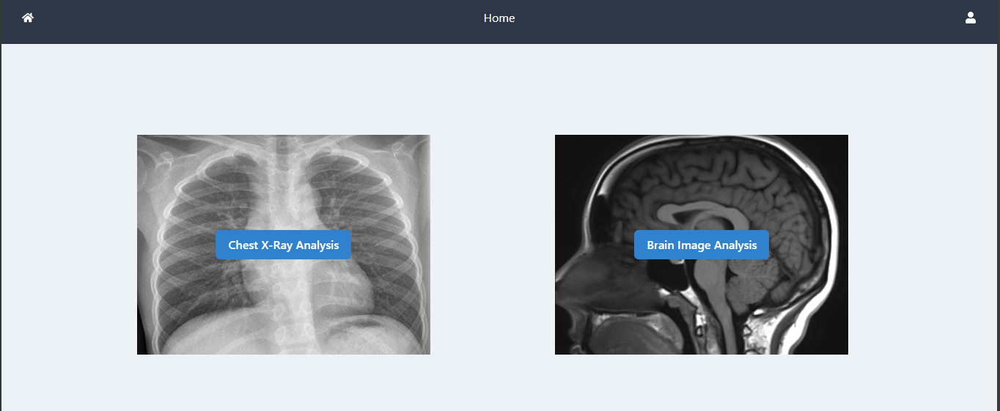

# Medical Image Analysis with AI

This application leverages AI to analyze medical images, specifically brain images and chest X-rays. Users can upload medical images, get predictions about potential issues, and verify or correct these predictions. The application ensures a smooth and secure user experience through a robust authentication system.

## Features

- **User Authentication**: Secure login system to protect user data.
- **Medical Image Analysis**: Upload and analyze brain images and chest X-rays.
- **AI Predictions**: Get AI-generated predictions for uploaded images.
- **User Verification**: Verify or correct AI predictions to improve accuracy.
- **Responsive Design**: User-friendly interface

### Login Page


- Secure login page powered by Asgardeo for user authentication.

### Home Page



- The home page allows users to select between chest X-ray analysis and brain image analysis.

### Select Scan


- After login, users can choose between different types of medical scans to analyze.

### Brain Image Layout


- Upload brain images for AI analysis. The AI predicts the presence of tumors, and users can verify or correct these predictions.

### Chest X-ray Layout


- Upload chest X-rays for AI analysis. The AI detects issues such as pneumonia and provides a detailed analysis.


- Users can interact with the system to get more detailed explanations of the findings with chat.

### Prediction Verification


- Users can correct AI predictions, enhancing the learning and accuracy of the model.

## Setup Instructions

To run this application locally, follow these steps:

1. **Clone the repository**:

   ```bash
   git clone https://github.com/ThemiraChathumina/medAI.git
   cd medAI
   npm install

   ```

2. **Update the config.ts in the root directory and add your Asgardeo configuration details:**:

   ```typescript
   const baseURL = "http://localhost:5173";

   export const config = {
     signInRedirectURL: baseURL,
     signOutRedirectURL: `${baseURL}/login`,
     clientID: "YOUR_CLIENT_ID",
     baseUrl: "https://api.asgardeo.io/t/YOUR_TENANT_NAME",
     scope: ["openid", "profile"],
   };
   ```

3. **Setup and run the backend in [medAI Backend](https://github.com/ThemiraChathumina/radiology).**

4. **Run the application:**

   ```bash
   npm run dev

   ```

## Credits

This application uses models and techniques described in the following paper:

> **Interactive and Explainable Region-guided Radiology Report Generation**  
> Tim Tanida, Philip Müller, Georgios Kaissis, Daniel Rueckert  
> In Proceedings of the IEEE/CVF Conference on Computer Vision and Pattern Recognition (CVPR), 2023.

The code for the models can be found in their [GitHub repository](https://github.com/ttanida/rgrg/tree/main).

The following datasets were used for model training:

- [Brain Tumor Classification (MRI) Dataset](https://www.kaggle.com/datasets/sartajbhuvaji/brain-tumor-classification-mri)
- [Chest X-ray Pneumonia Dataset](https://www.kaggle.com/datasets/paultimothymooney/chest-xray-pneumonia)

